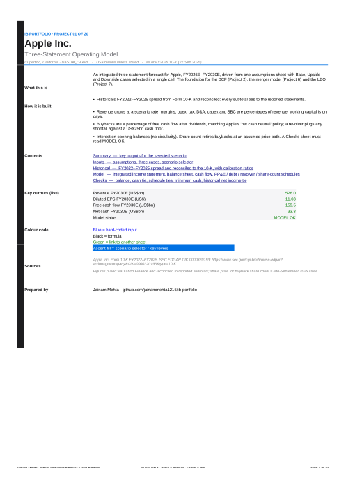
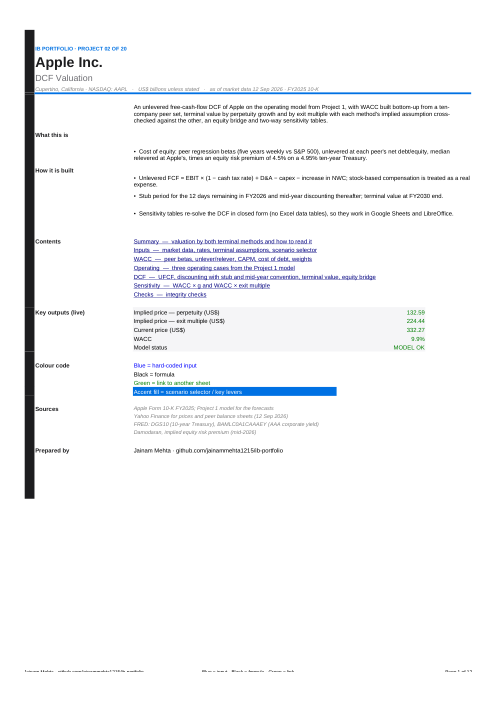
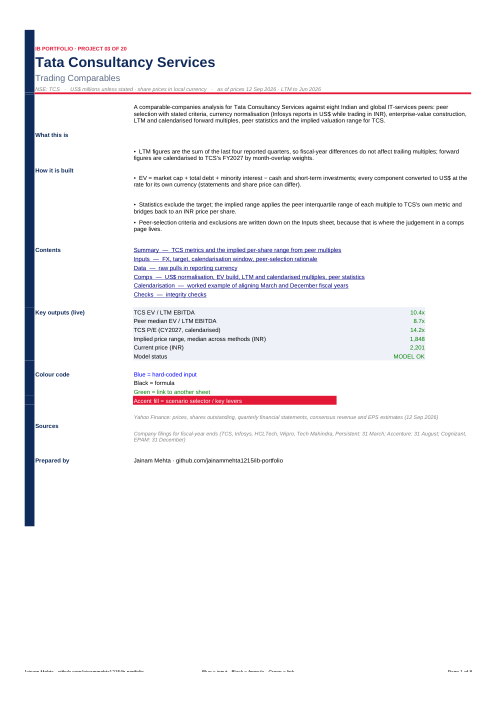
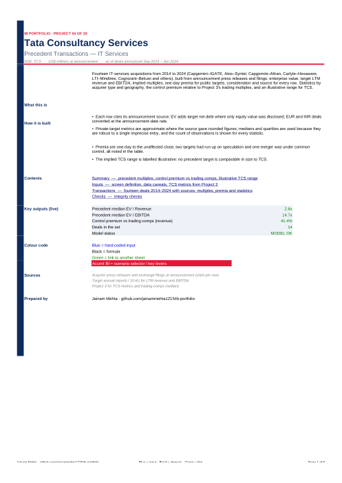
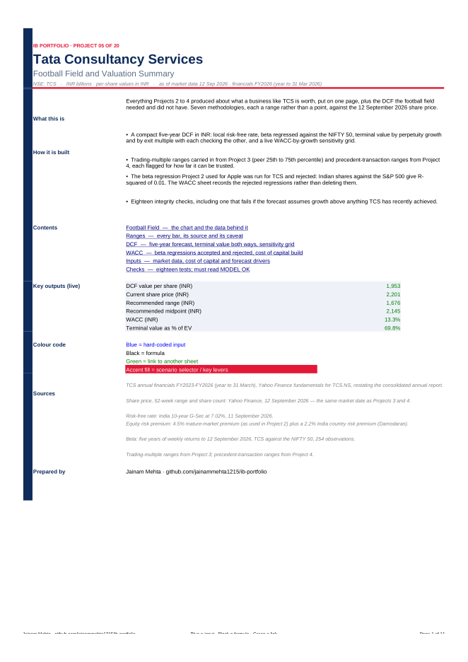
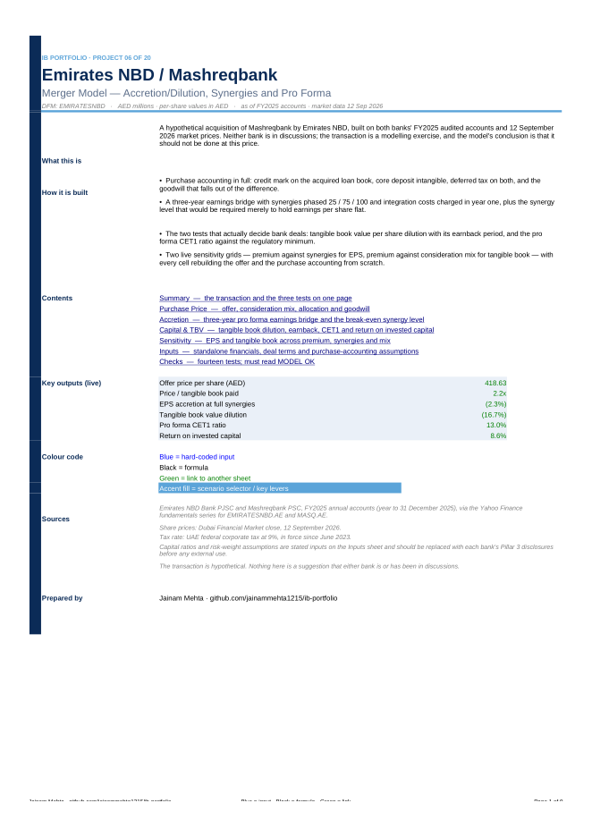

# IB Portfolio — Jainam Mehta

Investment-banking analyses built the way an analyst builds them: Excel models with live formulas and a checks sheet, PDF prints, and a notes page per project that says what was done, what it shows and what I would change. Companies are a mix of Western, Indian and UAE/Gulf large caps. All data is public (SEC EDGAR, company annual reports, exchange disclosures, Yahoo Finance, FRED, Damodaran).

Every workbook opens in Excel or Google Sheets; every PDF is the print of the key sheets for anyone who won't open a spreadsheet.

## Projects

| # | Project | Company | Region | Status | Files |
|---|---|---|---|---|---|
| 1 | Three-statement operating model with scenario toggle | Apple Inc. | Western | ✅ | [Excel](01-apple-three-statement-model/Apple_3S_Model.xlsx) · [PDF](01-apple-three-statement-model/Apple_3S_Model.pdf) · [Notes](01-apple-three-statement-model/notes.md) |
| 2 | DCF valuation with full WACC build and sensitivities | Apple Inc. | Western | ✅ | [Excel](02-apple-dcf/Apple_DCF.xlsx) · [PDF](02-apple-dcf/Apple_DCF.pdf) · [Notes](02-apple-dcf/notes.md) |
| 3 | Trading comparables engine | TCS vs IT-services peers | Indian | ✅ | [Excel](03-tcs-trading-comps/TCS_Trading_Comps.xlsx) · [PDF](03-tcs-trading-comps/TCS_Trading_Comps.pdf) · [Notes](03-tcs-trading-comps/notes.md) |
| 4 | Precedent transactions | IT services deals 2014–2024 | Western · Indian | ✅ | [Excel](04-precedent-transactions/IT_Services_Precedents.xlsx) · [PDF](04-precedent-transactions/IT_Services_Precedents.pdf) · [Notes](04-precedent-transactions/notes.md) |
| 5 | Football field: eight methods, weighted recommended range, rupee DCF | TCS | Indian | ✅ | [Excel](05-football-field/TCS_Football_Field.xlsx) · [PDF](05-football-field/TCS_Football_Field.pdf) · [Notes](05-football-field/notes.md) |
| 6 | Merger model: accretion/dilution, synergies, pro forma | Emirates NBD / Mashreqbank (hypothetical) | UAE | ✅ | [Excel](06-uae-bank-merger/ENBD_Mashreq_Merger_Model.xlsx) · [PDF](06-uae-bank-merger/ENBD_Mashreq_Merger_Model.pdf) · [Notes](06-uae-bank-merger/notes.md) |
| 7 | Leveraged buyout with debt schedule and returns | US large-cap take-private (hypothetical) | Western | planned | |
| 8 | Debt capacity and capital structure | Reliance Industries | Indian | planned | |
| 9 | IPO valuation and pricing rebuild | DEWA (2022) or Saudi Aramco (2019) | UAE · Gulf | planned | |
| 10 | Sum-of-the-parts | Reliance Industries | Indian | planned | |
| 11 | Bank valuation: DDM and excess-return | Emirates NBD | UAE | planned | |
| 12 | Energy NAV and price-deck sensitivity | Saudi Aramco | Gulf | planned | |
| 13 | Real-estate NAV and development appraisal | Emaar Properties | UAE | planned | |
| 14 | Quality of earnings and working-capital peg | Indian consumer company | Indian | planned | |
| 15 | Company profile and buyer screen | Salik | UAE | planned | |
| 16 | Full sell-side pitch book | Salik | UAE | planned | |
| 17 | Fairness opinion package | US public deal from a DEFM14A proxy | Western | planned | |
| 18 | Restructuring: liquidity, waterfall, debt-for-equity | Documented GCC or US case | UAE · Western | planned | |
| 19 | Deal-sourcing and comps-refresh dashboard (Python) | DFM, NSE and US universes | All | planned | |
| 20 | Capstone: live-deal replication | HDFC Bank – HDFC Ltd merger | Indian | planned | |

## Previews

| Project 1 · Apple three-statement model | Project 2 · Apple DCF | Project 3 · TCS trading comps |
|---|---|---|
|  |  |  |

| Project 4 · IT-services precedents | Project 5 · TCS football field | Project 6 · ENBD / Mashreq merger |
|---|---|---|
|  |  |  |

## Design

Every workbook is built with `ibkit/style.py`: a brand palette per company (title bands, section headers, cover sidebar), a designed cover with contents, live key outputs and sources, print headers and footers, fit-to-width on every sheet. Inside the grid the banking convention never changes: blue inputs, black formulas, green links.

## Conventions

Blue = hard-coded input · black = formula · green = link to another sheet · yellow fill = scenario selector and key levers. Every model has a `Checks` sheet that must read `MODEL OK`. No hard-coded numbers inside formulas. Every assumption has a source note next to it.

## Related

Six quantitative asset-allocation projects (portfolio optimisation, risk parity, factor models, macro nowcasting, yield curves) live in [asset-allocation-track](https://github.com/jainammehta1215/asset-allocation-track).
